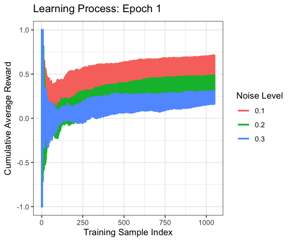

# RL2025Lawless: An Actor-Critic Reinforcement Learning Framework for Variant Evidence Interpretation

## Overview

This project implements a reinforcement learning (RL) framework designed to estimate the probability of observing genetic variants in disease. Instead of directly predicting variant pathogenicity, the framework quantifies the cumulative evidence supporting a variant’s clinical observability within a Bayesian context. The approach integrates established genomic metrics—including the GuRu score (formerly known as the ACMGuru score), gene risk priors, and population frequency—to learn which evidence correctly supports known variant labels. This adaptive learning step is intended to form the basis for subsequent Bayesian integration, yielding nuanced probability estimates for variant-disease associations. We built this base model by first replicating the cart-balancing pole problem from Sutton and Barto in R, followed by the implementation for genetics.

For an introduction into this topic see:

* Reinforcement Learning: An Introduction. Richard S. Sutton and Andrew G. Barto, Second Edition MIT Press, Cambridge, MA, 2018. <http://incompleteideas.net/book/RLbook2020.pdf#page=78>
* A. G. Barto, R. S. Sutton and C. W. Anderson, "Neuronlike adaptive elements that can solve difficult learning control problems," in IEEE Transactions on Systems, Man, and Cybernetics, vol. SMC-13, no. 5, pp. 834-846, Sept.-Oct. 1983, doi: 10.1109/TSMC.1983.6313077 <https://ieeexplore.ieee.org/document/6313077>
* A. G. Barto, R. S. Sutton and C. W. Anderson, "Looking Back on the Actor–Critic Architecture," in IEEE Transactions on Systems, Man, and Cybernetics: Systems, vol. 51, no. 1, pp. 40-50, Jan. 2021, doi: 10.1109/TSMC.2020.3041775 <https://ieeexplore.ieee.org/document/9306925>.
* An example of Classic Control environments can be [read on gymnasium](https://gymnasium.farama.org/environments/classic_control/cart_pole/), the Python-based API standard for reinforcement which came out of OpenAI's Gym.

<table>
  <tr>
    <td></td>
    <td></td>
  </tr>
</table>

The learning system consists of a single associative search element (ASE) and a single adaptive critic element (ACE).
**Figure:** Barto, et al. 2020. ASE and ACE configured for pole-balancing task. ACE receives same nonreinforcing input as ASE and uses it to compute an improved or internal reinforcement signal to be used by ASE.

## Key Features

- **Reinforcement Learning Framework:** Uses an actor-critic algorithm to learn from simulated genomic data with variable label noise.
- **Bayesian Evidence Integration:** Focuses on estimating the probability of observing a variant in disease, rather than a direct pathogenicity prediction.
- **Simulated Data Generation:** Creates synthetic datasets with 3,000 variants (50% known, 50% unknown) and varying noise levels (10%, 20%, 30%) to mimic real-world genomic variability.
- **Environment** On MacOS intel CPU at using 3 cores, 2000 variants requires 13 minutes, 3000 variants requires 25 minutes to run the main analysis. Rendering gifs takes ~ 10 minutes.
- **Performance Evaluation:** Assesses model performance using ROC curves, AUC, calibration plots, cumulative learning curves, and temporal-difference error metrics.
- **Parallel Computing:** Employs `doParallel` and `foreach` for efficient hyperparameter grid search over noise levels and learning rates.

## Dependencies

- **R** R version 4.4.0 (2024-04-24) (Platform: x86_64-apple-darwin20)
- R packages: `ggplot2`, `dplyr`, `caret`, `pROC`, `patchwork`, `doParallel`, `foreach`, `reshape2`, `knitr`, `gganimate`

## Usage

1. **Run Simulations:** Execute `sim_loop.R` to generate synthetic genomic data, train the RL model across various parameter settings, and evaluate performance.
2. **View Figures:** Execute `vis.R` and `vis_anim.R` to reload data and output plots (e.g., ROC curves, calibration plots, learning curves) are saved in the `figures/` directory.
3. **Manuscript Preparation:** LaTeX source files in the `latex/` directory are used to compile the final manuscript PDF.

## Further background summary

Important key ideas are found in this paper:
> A. G. Barto, R. S. Sutton and C. W. Anderson, "Neuronlike adaptive elements that can solve difficult learning control problems," in IEEE Transactions on Systems, Man, and Cybernetics, vol. SMC-13, no. 5, pp. 834-846, Sept.-Oct. 1983, doi: 10.1109/TSMC.1983.6313077.

TL;DR: In this article, a system consisting of two neuron-like adaptive elements can solve a difficult learning control problem, where the task is to balance a pole that is hinged to a movable cart by applying forces to the cart base.

Abstract: It is shown how a system consisting of two neuronlike adaptive elements can solve a difficult learning control problem. The task is to balance a pole that is hinged to a movable cart by applying forces to the cart's base. It is argued that the learning problems faced by adaptive elements that are components of adaptive networks are at least as difficult as this version of the pole-balancing problem. The learning system consists of a single associative search element (ASE) and a single adaptive critic element (ACE). In the course of learning to balance the pole, the ASE constructs associations between input and output by searching under the influence of reinforcement feedback, and the ACE constructs a more informative evaluation function than reinforcement feedback alone can provide. The differences between this approach and other attempts to solve problems using neurolike elements are discussed, as is the relation of this work to classical and instrumental conditioning in animal learning studies and its possible implications for research in the neurosciences.
